***Exposing Gen Ai Agents via Oracle Digital Assistant***

**Retrieve the Agent Endpoint ID**

1. Open your Gen ai Agent dashboard and go to the Agents tab as shown
below  
  
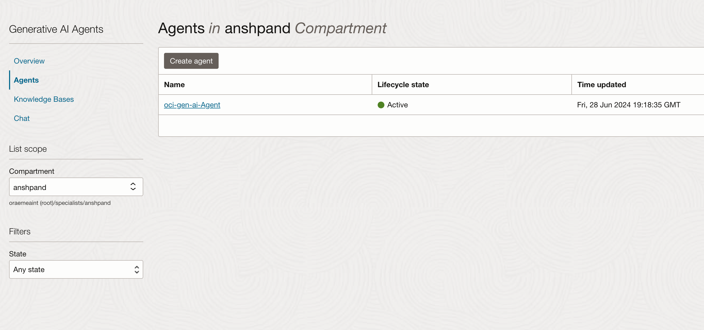

2\. Click on the Agent created and select the endpoints tab on the left
hand side of the screen as shown below

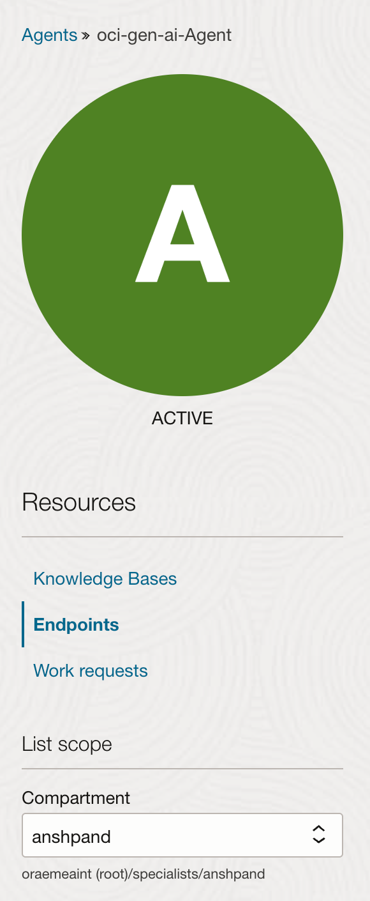

3\. On selecting endpoints tab , you will be able to see the endpoints
as shown below

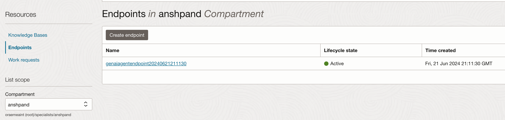

4\. Click on the endpoint and open it  
  
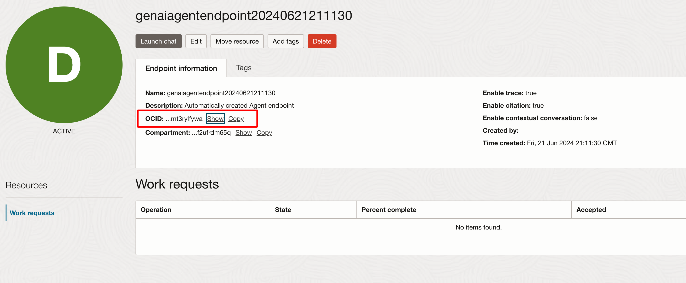

5\. The OCID value shown here will be your **agentEndpointId** which we
will be using going forward

**Configuring a Digital Assistant**

1\. Open Oracle Digital assistant instance

2\. Click the hamburger menu on the left hand corner and go to Settings
🡪 API Services

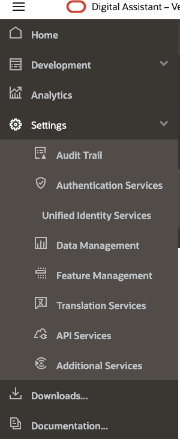

3\. Press Add Services Button to add the rest service to connect to Gen
AI Agent from ODA

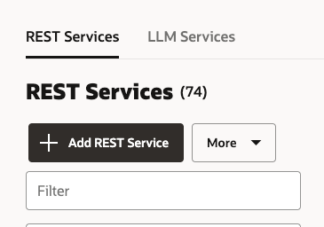

NOTE: Remember we need two apis

1.  Create a Session API (which should be called once to get the session
    id)

2.  Execute API (to get the answer fro gen ai agents using session id
    and agent id)

Fill in the details as shown below . Add a name , the endpoint from gen
ai agents , a description (optional) and the method which is POST in
this case

4\. Lets create the create session api first. Give the details as below
and press **Create** button

**Name**: genAiAgentCreateSession  
**Endpoint :**
https://agent-runtime.generativeai.us-chicago-1.oci.oraclecloud.com/20240531/agentEndpoints/{agentEndpointId}/sessions

**Methods :** POST

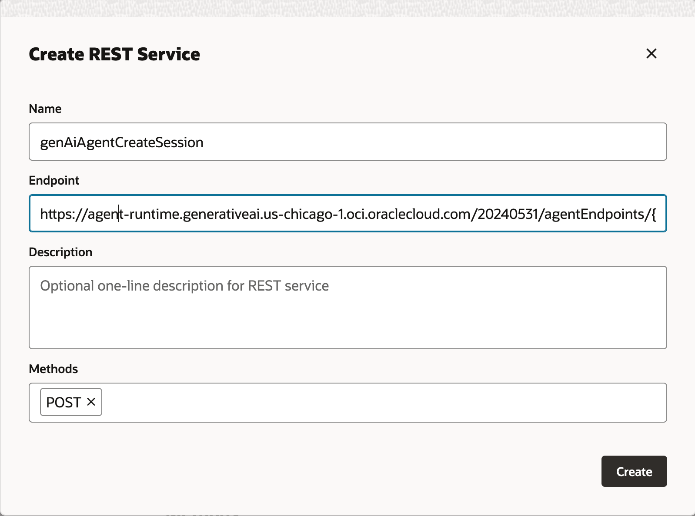

5\. Once the api is created , go inside and select Authentication type
to OCI Resource Principal as shown below  
  
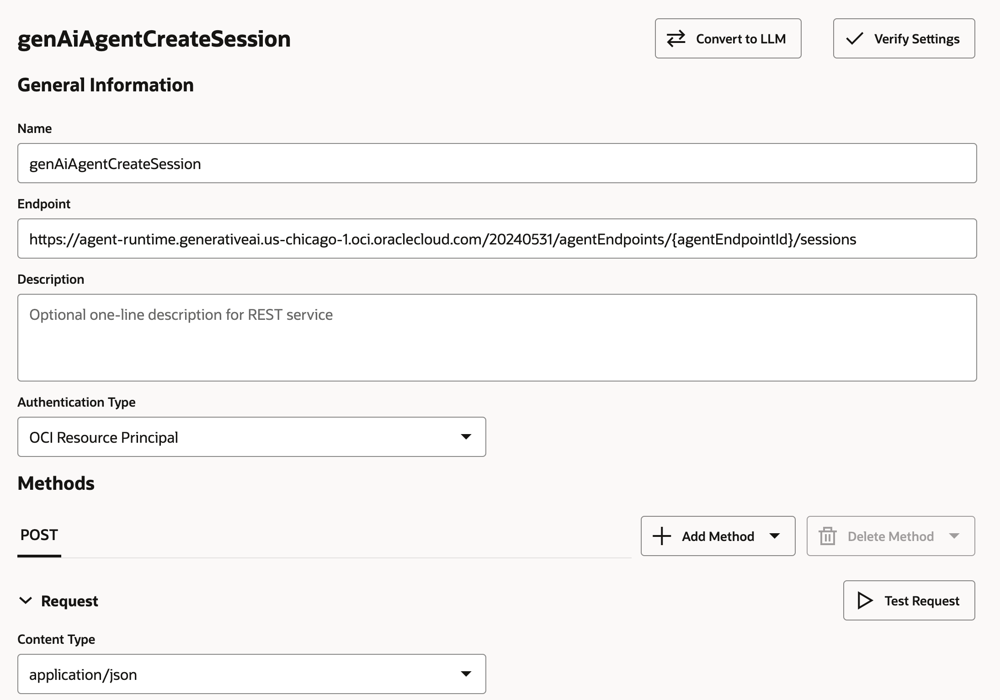

In the body section add the below

{

"idleTimeoutInSeconds": 3600

}

In the parameters section add the parameter agentEndpointId as shown
below  
  
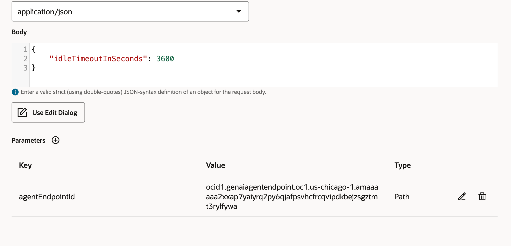

You can now test the above using the Test Request button

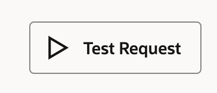

You can also download the above api from
[here](https://objectstorage.eu-frankfurt-1.oraclecloud.com/n/frpj5kvxryk1/b/genAiAgents/o/RESTService-genAiAgentCreateSession.yaml)
and import it

6\. Lets create the second API now which is the execute api. Give the
details as below and press **Create** button

**Name**: genAiAgentexecute  
**Endpoint :**
https://agent-runtime.generativeai.us-chicago-1.oci.oraclecloud.com/20240531/agentEndpoints/{agentEndpointId}/sessions/{sessionId}/actions/execute

**Methods :** POST

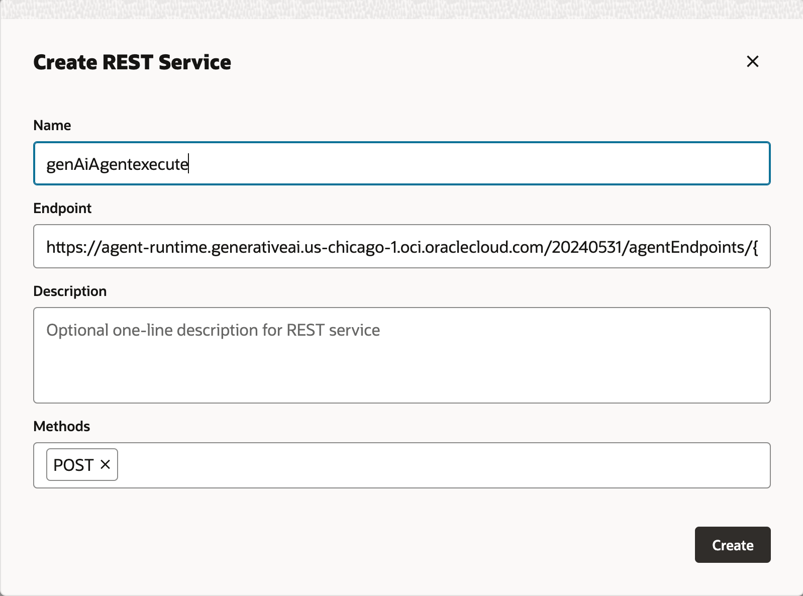

7\. Once the api is created , go inside and select Authentication type
to OCI Resource Principal as shown below

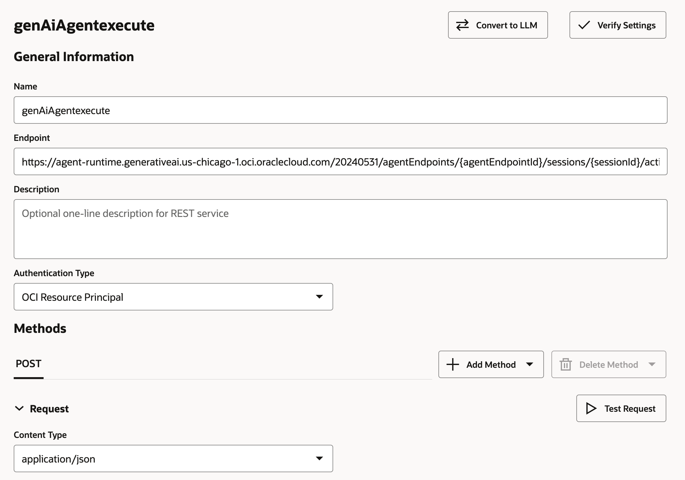

In the body section add the below

{

"userMessage": "Your question related to the agent created",

"shouldStream": false

}

In the parameters section add the parameter agentEndpointId , sessionId
as shown below

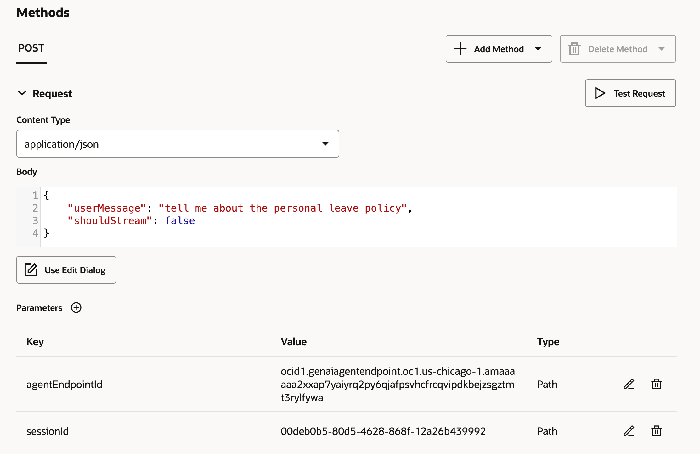

You can now test the above using the Test Request button

You can also download the above api from
[here](https://objectstorage.eu-frankfurt-1.oraclecloud.com/n/frpj5kvxryk1/b/genAiAgents/o/RESTService-genAiAgentexecute.yaml)
and import it

8\. Now that you have your api is working, its ready to be called by any
skill in the instance. Now let’s go ahead and create a skill which will
call the api

9\. For creating the skill go to the left hand hamburger menu and click
that. Go to Development🡪 Skills

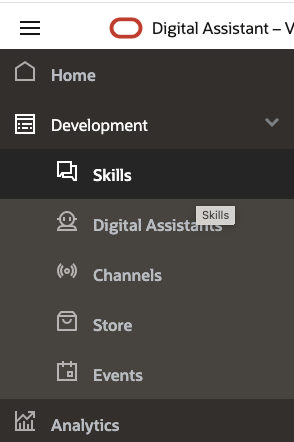

10\. Download the skill from this
[link](https://objectstorage.eu-frankfurt-1.oraclecloud.com/n/frpj5kvxryk1/b/genAiAgents/o/genAiAgentsSkill(1.0).zip)
. Click on Import skills in the right hand corner of your screen and
import this skill named **genAiAgentsSkill**

11\. One the skill is imported open the skill and go the settings button
on the right hand side as marked below

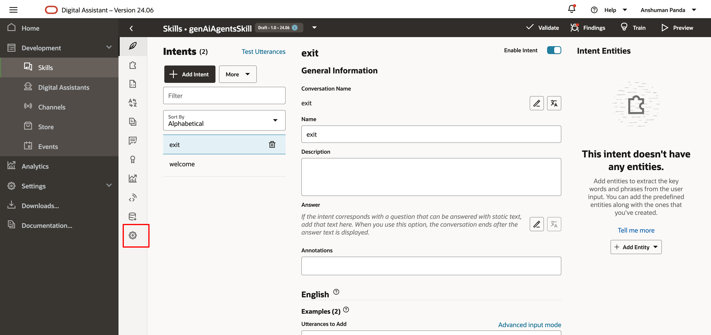

12\. Go to the Configuration tab under Settings

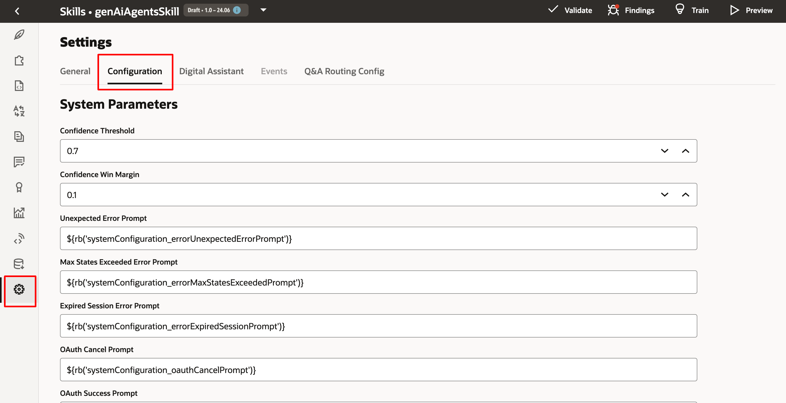

13\. Scroll down the page to go to Custom Parameters

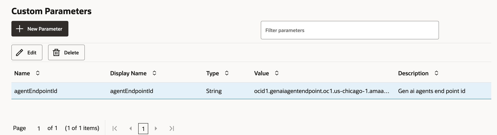

14\. Select the parameter agentEndpointId and press the edit button and
change the value field to your specific endpoint id and press OK  
  
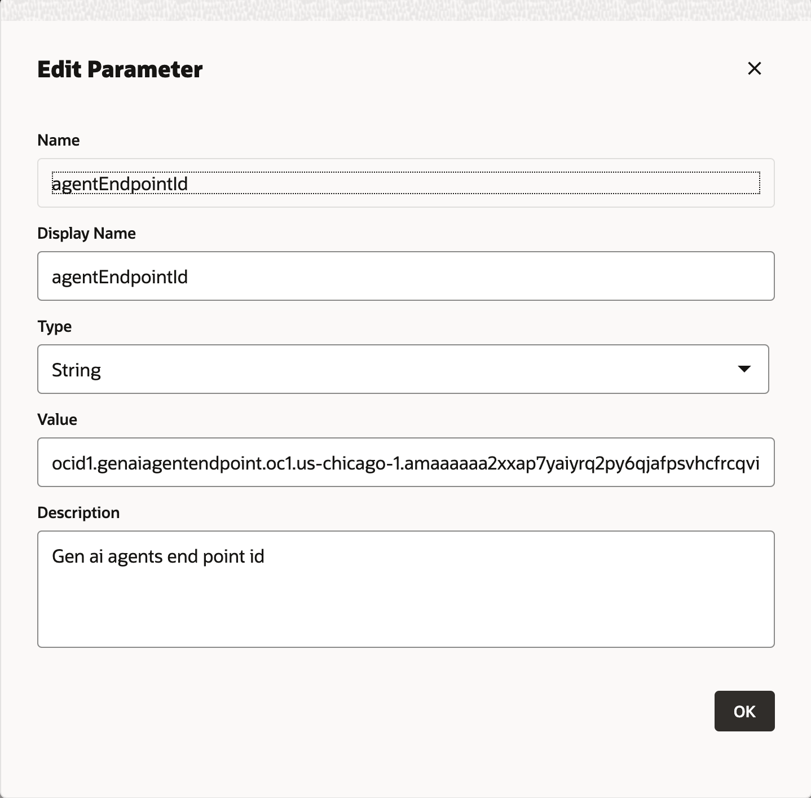

15\. Now select the preview button on the top right corner of your
screen and type ‘hi’ in the bot tester

You will receive a welcome message  
  
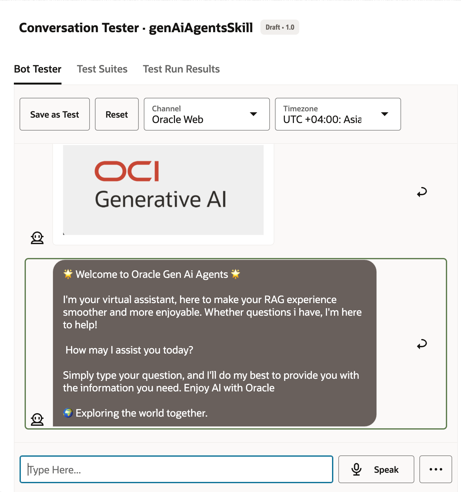

Now type your question you want to ask to the agent and get the reply
